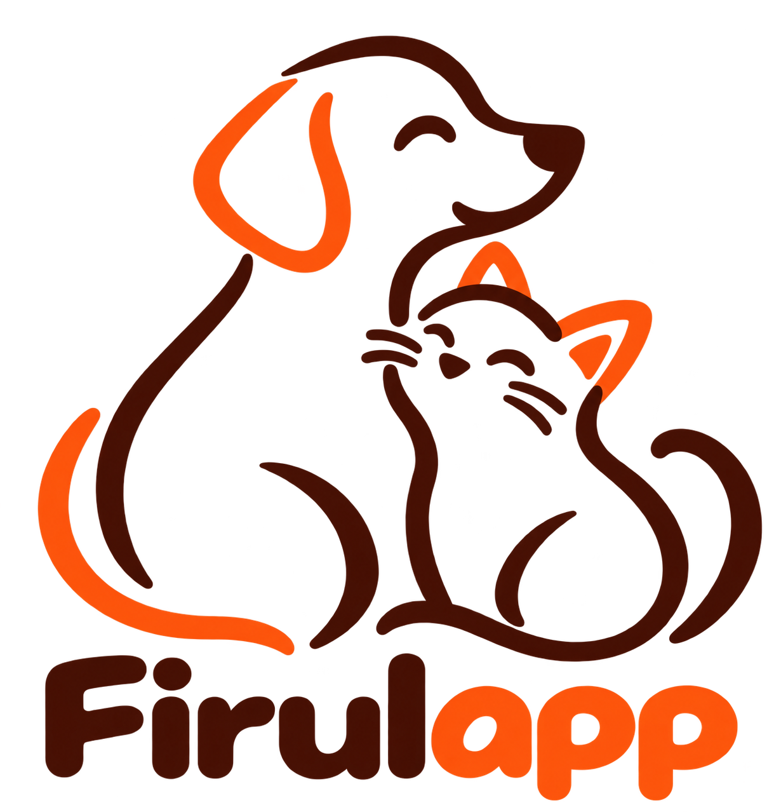

# Firulapp - Gestor de PQRS para MEPEGA

**Universidad de Antioquia - Facultad de Ingeniería - Departamento de Ingeniería Industrial**

**Curso:** Algoritmia y Programación 2026-2

**Docente:** Julián Andrés Castillo

**Entrega 1:** 

---

## 1. Integrantes

Somos un equipo de cuatro estudiantes de Ingeniería Industrial de la Universidad de Antioquia. Nos juntamos para hacer el Proyecto Integrador del curso, que consiste en crear un programa en Python para registrar y gestionar las PQRS (peticiones, quejas, reclamos y sugerencias) del Movimiento Estudiantil de Perritos y Gaticos (MEPEGA).

| Nombre completo | Rol en el equipo |
|---|---|
| Jose Federico Moncada Ortega | Líder del equipo y administrador del repositorio en GitHub |
| Diego Andrés Landinez Álvarez | Integrante |
| Sebastian Cruz Rendón | Integrante |
| Miguel Ángel Gaviria Aristizábal | Integrante |

---

## 2. Vínculos académicos y descripción

### Jose Federico Moncada Ortega
- **Programa:** Ingeniería Industrial - Universidad de Antioquia
- **Módulo a cargo:** menú principal, clases y conexión de todos los módulos
- **Habilidades y fortalezas:** es organizado y tiene facilidad para liderar y coordinar al equipo. Tiene buena redacción, lo que ayuda mucho con la documentación del proyecto. Siempre le ha generado curiosidad la programación y aprende mejor haciendo las cosas.

### Diego Andrés Landinez Álvarez
- **Programa:** Ingeniería Industrial - Universidad de Antioquia
- **Módulo a cargo:** `reportes.py`
- **Habilidades y fortalezas:** es bueno resolviendo problemas y es constante con lo que se propone. No se desanima con los errores, sino que los ve como una forma de aprender.

### Sebastian Cruz Rendón
- **Programa:** Ingeniería Industrial - Universidad de Antioquia
- **Módulo a cargo:** `archivos.py`
- **Habilidades y fortalezas:** tiene buena lógica y es cuidadoso con los detalles y con la calidad de lo que hace. Le interesa mucho el manejo de archivos y la validación de datos.

### Miguel Ángel Gaviria Aristizábal
- **Programa:** Ingeniería Industrial - Universidad de Antioquia
- **Módulo a cargo:** `validaciones.py`
- **Habilidades y fortalezas:** es responsable y comprometido con sus tareas. Trabaja bien en equipo y siempre aporta ideas. Además, es bueno entendiendo códigos, lo que sirve mucho de apoyo a la hora de revisar el trabajo realizado de los demás.

---

## 3. Nombre del proyecto y detalles

### Firulapp

El nombre sale de **"Firulais"**, el famoso nombre que todos conocemos, en Colombia, a la hora de hablar de una mascota, y de **"app"**. En el logo pusimos un perrito y un gatico juntos, porque el programa es para atender las solicitudes de los dos.

**Firulapp** es un programa de consola hecho en Python que le permite al administrador de MEPEGA registrar las PQRS que llegan sobre la atención de perros y gatos en la UdeA. Cada PQRS queda guardada en su propio archivo plano con un número de radicado consecutivo. Además, el programa permite que se consulte el estado de las solicitudes, imprimir el radicado, avisar cuáles están por vencer y sacar estadísticas.
 
---

## 4. Licencia del software

Firulapp está bajo la licencia **Creative Commons Atribución-NoComercial-CompartirIgual 4.0 Internacional (CC BY-NC-SA 4.0)**.

[Ver la licencia completa](https://creativecommons.org/licenses/by-nc-sa/4.0/deed.es)

Esto quiere decir que cualquier persona puede usar, copiar, compartir y modificar el programa, siempre y cuando cumpla estas condiciones:

- **Atribución (BY):** tiene que darnos el crédito como autores del proyecto.
- **No Comercial (NC):** no puede usar el programa para ganar dinero.
- **Compartir Igual (SA):** si lo modifica o lo mejora, tiene que compartir su versión con esta misma licencia.

Escogimos esta licencia porque Firulapp es un proyecto académico hecho para un movimiento estudiantil sin ánimo de lucro. Queremos que otras personas puedan aprender del código y mejorarlo, pero que nadie haga negocio con nuestro trabajo sin nuestro permiso.

---

## 5. Reporte de visión

### ¿Qué es Firulapp?
Firulapp es un programa de consola que tiene como función registrar y gestionar las PQRS (peticiones, quejas, reclamos y sugerencias) que recibe MEPEGA de los servicios veterinarios para perros y gatos en la Universidad de Antioquia.

### ¿Qué problema resuelve?
MEPEGA recibe PQRS por muchos medios: redes sociales, correo electrónico, papel, voz a voz, entre otros. Hoy los estudiantes las procesan a papel y lápiz y les asignan un número consecutivo a mano. Esto hace que facilmente se pueda perder la información, repetir números o que se pase el plazo de respuesta sin que nadie se dé cuenta, porque cada PQRS tiene máximo 30 días calendario para ser respondida.

### Objetivo general
Crear un programa de consola en Python, fácil de usar para el administrador de MEPEGA, que permita registrar, consultar y hacerle seguimiento a las PQRS usando archivos planos.

### Objetivos específicos
- Registrar cada PQRS revisando que los datos ingresados sean correctos.
- Guardar cada tipo de PQRS en su propio archivo plano, con un número de radicado consecutivo y sin repetir.
- Calcular automáticamente la fecha máxima de respuesta (30 días después del registro).
- Controlar el estado de cada PQRS: Registrada, En proceso y Solucionada.
- Imprimir un radicado en formato de texto que certifique su registro.
- Avisar cuáles PQRS están por vencer o ya se vencieron.
- Generar estadísticas que ayuden a MEPEGA a tomar decisiones.

### ¿Quién lo usa?
El administrador de MEPEGA, que es la persona encargada de recibir y registrar las PQRS en el sistema.

### Beneficios
- **Orden:** toda la información queda guardada y organizada por tipo de solicitud, no en hojas sueltas.
- **Menos errores:** el programa revisa los datos antes de guardarlos y da el número de radicado solo, así que no se repiten números.
- **Control de tiempos:** el programa calcula la fecha máxima de respuesta y avisa cuando una PQRS está por vencer, para que ninguna se quede sin responder.
- **Constancia:** cada PQRS tiene su radicado impreso, que sirve como comprobante para la persona que hizo la solicitud.
- **Información útil:** las estadísticas muestran qué tipo de solicitudes llegan más, para qué mascotas, cuáles llevan más tiempo esperando y cuánto se demora MEPEGA en responder.

---

## 6. Especificación de requisitos

### 6.1 Requisitos funcionales
Son las acciones que el programa debe hacer.

**RF_01. Menú principal**
El programa debe mostrar un menú en consola desde donde el administrador pueda escoger qué quiere hacer: registrar una PQRS, consultar el estado, actualizar el estado, imprimir el radicado, ver las estadísticas o salir.

**RF_02. Registrar una PQRS**
El programa debe pedir y guardar estos datos:
- **Datos del solicitante:** nombre completo, tipo y número de documento, tipo de teléfono y teléfono de contacto, correo electrónico y dirección.
- **Información de la PQRS:** tipo de solicitud, fecha de radicación, canal de recepción, asunto o título y descripción detallada.
- **Información relacionada:** tipo de mascota (perro o gato) y campus.

**RF_03. Validar los datos ingresados**
Antes de guardar, el programa debe revisar que cada dato cumpla estas reglas. Si un dato está mal, debe avisar y volver a pedirlo.

| Campo | Regla |
|---|---|
| Nombre completo | Obligatorio. Entre 3 y 100 caracteres. Solo letras, espacios, tildes, ñ, (') y (-). No permite números. |
| Tipo de documento | Obligatorio. Solo CC, TI, CE, PP o NIT. |
| Número de documento | Obligatorio. Entre 3 y 15 dígitos. Solo números. |
| Tipo de teléfono | Obligatorio. Solo Celular, Fijo, Corporativo u Otro. |
| Teléfono de contacto | Obligatorio. Exactamente 10 dígitos. Solo números. |
| Correo electrónico | Obligatorio. Máximo 254 caracteres. Debe tener un solo @ y un dominio válido (correo@dominio.com). |
| Dirección | Opcional. Entre 5 y 200 caracteres. Permite letras, números y los caracteres # - . / |
| Tipo de solicitud | Obligatorio. Solo Petición, Queja, Reclamo o Sugerencia. |
| Fecha de radicación | Obligatoria. Con el formato de la librería `datetime`. No puede ser una fecha futura. |
| Canal de recepción | Obligatorio. Solo Presencial, Correo electrónico, Página web, Teléfono, Redes sociales u Otro. |
| Asunto o título | Obligatorio. Entre 5 y 150 caracteres. Permite letras, números y signos de puntuación básicos. |
| Descripción detallada | Obligatoria. Entre 20 y 2.000 caracteres. No puede estar vacía ni tener solo espacios. |
| Tipo de mascota | Obligatorio. Solo Perro o Gato. |
| Campus relacionado | Obligatorio. Solo uno de los 9 campus de la UdeA que aparecen en el enunciado del proyecto. |
| Estado de la petición | Obligatorio. Solo Registrada, En proceso o Solucionada. |

**RF_04. Asignar el número de radicado (ID)**
Cada PQRS debe tener un ID entero que empiece en 1 y aumente de uno en uno con cada registro. Cada archivo tiene su propia numeración, independiente de los demás, y no se pueden repetir números.

**RF_05. Guardar en archivos planos**
Cada PQRS se debe guardar en el archivo que le corresponde según su tipo. Los cuatro archivos manejan la misma estructura de datos y se guardan en la carpeta `data`.

| Archivo | Contenido |
|---|---|
| `Peticion.txt` | Registros de peticiones |
| `Queja.txt` | Registros de quejas |
| `Reclamo.txt` | Registros de reclamos |
| `Sugerencia.txt` | Registros de sugerencias |

Los campos de cada registro son: `id`, `nombre_completo`, `tipo_documento`, `numero_documento`, `tipo_telefono`, `telefono_contacto`, `correo_electronico`, `direccion`, `tipo_solicitud`, `fecha_radicacion`, `canal_recepcion`, `asunto_titulo`, `descripcion_detallada`, `tipo_mascota`, `campus_relacionado`, `fecha_maxima_respuesta`, `estado_peticion` y `fecha_solucion`.

> **Nota:** el campo `fecha_solucion` no aparece en la lista de campos recomendados del enunciado. Lo agregamos nosotros porque es necesario para calcular la estadística obligatoria del promedio de días de respuesta. El programa lo llena automáticamente cuando la PQRS pasa a estado "Solucionada".

**RF_06. Calcular la fecha máxima de respuesta**
El programa debe calcular automáticamente la fecha máxima de respuesta con la fórmula: fecha de registro + 30 días.

**RF_07. Actualizar el estado de una PQRS**
Toda PQRS debe empezar en estado "Registrada". El administrador puede cambiar el estado, pero solo en este orden: **Registrada -> En proceso -> Solucionada**. El programa no debe dejar saltarse un paso ni devolverse. Cuando la PQRS pase a "Solucionada", se debe guardar la fecha de solución.

**RF_08. Imprimir el radicado**
El programa debe generar un comprobante en un archivo de texto (TXT) con estas características:
- Cada línea debe medir exactamente 120 caracteres.
- Debe tener un marco hecho con los caracteres +, - y |.
- Debe estar alineado y centrado en sus secciones principales.

El radicado debe mostrar:
- **Encabezado:** título del comprobante y nombre del sistema.
- **Datos del radicado:** ID, fecha y hora de radicación, estado inicial (Registrada) y fecha máxima de respuesta.
- **Datos del solicitante:** nombre completo, tipo y número de documento, teléfono (con su tipo), correo y dirección.
- **Clasificación:** tipo de solicitud, canal de recepción, tipo de mascota y campus.
- **Resumen:** asunto o título.

No debe incluir la descripción detallada, para ahorrar espacio. Si la persona no dio dirección, va aparecer "N/A".

**RF_09. Consultar el estado de las PQRS**
El programa debe permitir consultar los registros y su estado, y mostrarlos con el mismo formato del radicado.

**RF_10. Alerta de tiempo**
El programa debe avisarle al administrador cuáles PQRS están cerca de su fecha máxima de respuesta y cuáles ya se vencieron sin ser solucionadas.

**RF_11. Estadísticas**
El programa debe generar estas estadísticas a partir de los datos guardados:

| # | Estadística | ¿Para qué le sirve a MEPEGA? |
|---|---|---|
| Obligatoria | Promedio de días (en números enteros) que se toma dar respuesta a una PQRS | Saber qué tan rápido se están respondiendo las solicitudes. |
| 1 | Cantidad de PQRS por tipo (peticiones, quejas, reclamos y sugerencias) | Ver qué tipo de solicitud llega más, por ejemplo si hay muchas quejas. |
| 2 | Cantidad de PQRS por tipo de mascota (perros y gatos) | Saber hacia dónde enfocar los servicios. |
| 3 | PQRS más antigua(s) sin solucionar | Identificar las que llevan más tiempo esperando respuesta. |
| 4 | PQRS a punto de vencer | Darles prioridad a las que están cerca de los 30 días. |
| 5 | PQRS vencidas sin respuesta | Ver cuáles ya pasaron el plazo sin solucionarse. |

### 6.2 Requisitos no funcionales
Son las características que muestran qué tan bueno funciona el programa, más allá de lo que hace.

**RNF_01. Usabilidad**
El menú debe ser claro, fácil y sencillo de entender, con opciones numeradas y mensajes que le digan al administrador qué dato debe escribir y qué pasó después de cada acción.

**RNF_02. Fiabilidad**
El programa no se debe cerrar ni dañar por un dato mal escrito. Si el administrador se equivoca, el programa le avisa el error y le vuelve a pedir el dato. Además, los números de radicado nunca se deben repetir.

**RNF_03. Rendimiento**
Registrar, consultar o sacar las estadísticas, sin que el administrador tenga que esperar mucho tiempo.

**RNF_04. Seguridad de la información**
La información de las PQRS solo se guarda en los archivos planos del programa, dentro de la carpeta `data`. Los registros no se borran, solo se les cambia el estado.

**RNF_05. Compatibilidad**
El programa está hecho en Python 3, así que se puede usar en Windows, Mac o Linux. Solo necesita una consola y la librería `datetime`, que ya viene con Python.

**RNF_06. Organización y mantenimiento del código**
El código debe estar dividido en módulos para que sea más fácil de entender y de corregir:
- `validaciones.py`: funciones que revisan el correo, el teléfono, las fechas y los nombres.
- `archivos.py`: lectura y escritura de los cuatro archivos planos.
- `reportes.py`: cálculo de la estadística y de las cinco adicionales.

Además, el código debe tener comentarios que expliquen qué hace cada parte.

---

## 7. Plan de proyecto

### 7.1 Actividades

| # | Actividad | Responsable(s) | Fechas |
|---|---|---|---|
| 1 | Conformación del equipo y firma de actas | Todos | 31 de agosto de 2026 |
| 2 | Lectura del enunciado, definición de requisitos, nombre, logo y licencia | Todos | 1 al 20 de septiembre de 2026 |
| 3 | Entrega 1 (puntos 1 a 7) | Todos | 21 al 27 de septiembre de 2026 |
| 4 | Primera versión de cada módulo (`validaciones.py`, `archivos.py` y `reportes.py`) | Miguel, Sebastian y Diego | 5 al 9 de octubre de 2026 |
| 5 | Integración de los módulos en el programa principal (menú y clases) | Federico | 19 al 23 de octubre de 2026 |
| 6 | Pruebas del programa completo | Todos | 2 al 6 de noviembre de 2026 |
| 7 | Últimos ajustes y documentación (manual de usuario, plan de versionado y repositorio) | Todos | 16 al 20 de noviembre de 2026 |
| 8 | Entrega 2 y sustentación | Todos | 30 de noviembre al 5 de diciembre de 2026 |

Las fechas de la Entrega 1 y la Entrega 2 las definió el docente. Las demás son fechas internas del equipo y las podemos ajustar a medida del semestre, siempre avisando con tiempo y respetando el tiempo de los demás.

### 7.2 Cronograma (Diagrama de Gantt)

Cada columna es una semana que empieza en la fecha indicada (lunes). El símbolo ■ marca la semana en que se hace cada actividad.

| Actividad | 31 ago | 7 sep | 14 sep | 21 sep | 28 sep | 5 oct | 12 oct | 19 oct | 26 oct | 2 nov | 9 nov | 16 nov | 23 nov | 30 nov |
|---|---|---|---|---|---|---|---|---|---|---|---|---|---|---|
| 1. Conformación del equipo y actas | ■ | | | | | | | | | | | | | |
| 2. Requisitos, nombre, logo y licencia | ■ | ■ | ■ | | | | | | | | | | | |
| 3. Entrega 1 | | | | ■ | | | | | | | | | | |
| 4. Primera versión de los módulos | | | | | | ■ | | | | | | | | |
| 5. Integración en el programa principal | | | | | | | | ■ | | | | | | |
| 6. Pruebas del programa completo | | | | | | | | | | ■ | | | | |
| 7. Ajustes y documentación | | | | | | | | | | | | ■ | | |
| 8. Entrega 2 y sustentación | | | | | | | | | | | | | | ■ |

### 7.3 Presupuesto

El proyecto no se paga en dinero sino en tiempo de práctica de formación. Entre los cuatro integrantes invertimos un total de **50 horas**, que se pagan al valor de una práctica profesional: **1 SMLV**.

**Datos que usamos:**
- **Salario mínimo 2026:** $1.750.905 al mes (Decreto 1469 de 2025).
- **Jornada laboral:** desde el 15 de julio de 2026 la jornada máxima es de 42 horas a la semana (Ley 2101 de 2021), lo que equivale a 210 horas al mes.

**Cálculo:**

| Concepto | Cálculo | Valor |
|---|---|---|
| Valor de la hora | $1.750.905 ÷ 210 horas | $8.338 |
| Horas del proyecto | Total del equipo | 50 horas |
| **Costo total del proyecto** | 50 horas × $8.338 | **$416.900** |

El costo total del proyecto es de **$416.900**.
